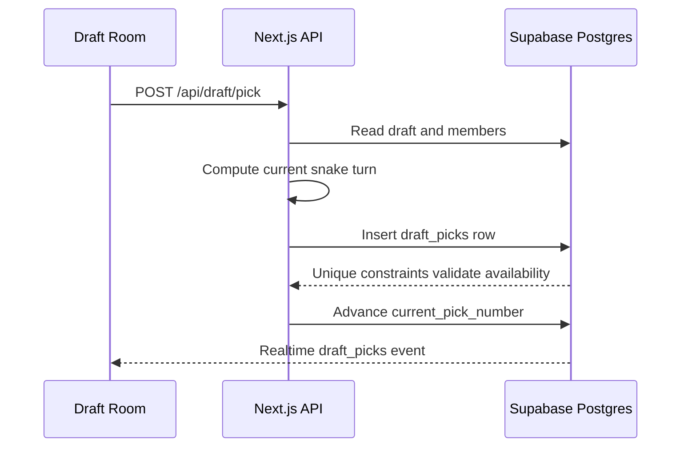

# Drafting Architecture

This MVP keeps the draft model intentionally small:

1. League members receive a fixed `draft_position`.
2. A league owns one row in `drafts`.
3. Every successful pick inserts one row in `draft_picks`.
4. The API increments `drafts.current_pick_number`.
5. The client subscribes to `drafts` and `draft_picks` through Supabase Realtime.

## Pick Flow

## Why This Shape

- The database owns uniqueness for drafted teams, drafted players, and pick numbers.
- The app owns turn calculation because it is deterministic and easy to test.
- Realtime is table-based, so no custom websocket server is required for Vercel.
- The server route uses the Supabase service role because draft picks are league mutations that need consistent validation.
